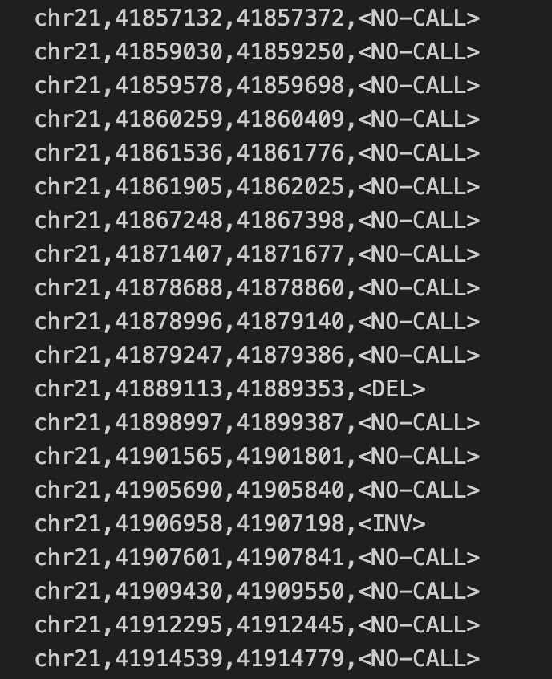

# LYCEUM : Learning to Call Copy Number Variants on Low Coverage Ancient Genomes


[](https://doi.org/10.5281/zenodo.13997011)


> LYCEUM is a deep learning-based tool designed for predicting copy number variations (CNVs) in ancient whole-genome sequencing (WGS) data using read depth sequences.


> The manuscript can be found here:  <a href="https://www.biorxiv.org/content/10.1101/2024.10.28.620589v2" target="_blank">**LYCEUM : Learning to Call Copy Number Variants on Low Coverage Ancient Genomes**</a>

> The repository with processed samples, groundtruth data, and CNV predictions for real and simulated datasets to reproduce the analyses in the paper can be found here: <a href="https://doi.org/10.5281/zenodo.13997011" target="_blank">**LYCEUM results reproduction**</a>

> <a href="https://en.wikipedia.org/wiki/Deep_learning" target="_blank">**Deep Learning**</a>, <a href="https://en.wikipedia.org/wiki/Ancient_DNA" target="_blank">**Ancient DNA**</a>, <a href="https://en.wikipedia.org/wiki/Copy-number_variation" target="_blank">**Copy Number Variation**</a>, <a href="https://en.wikipedia.org/wiki/Whole_genome_sequencing" target="_blank">**Whole Genome Sequencing**</a>


---

## Authors

Mehmet Alper Yilmaz, Ahmet Arda Ceylan, Gun Kaynar, A. Ercument Cicek

---

## Questions & comments 

[firstauthorname].[firstauthorsurname]@bilkent.edu.tr

[lastauthorsurname]@cs.bilkent.edu.tr

---


## Table of Contents 

> Warning: Please note that LYCEUM software is completely free for academic usage. However it is licenced for commercial usage. Please first refer to the [License](#license) section for more info.

- [Installation](#installation)
- [Features](#features)
- [Instructions Manual](#instructions-manual)
- [Usage Examples](#usage-examples)
- [Citations](#citations)
- [License](#license)


---

## Installation

- LYCEUM is a python3 script and it is easy to run after the required packages are installed.

### Requirements

For easy requirement handling, you can use LYCEUM_environment.yml files to initialize conda environment with requirements installed:

```shell
$ conda env create --name lyceum_env -f LYCEUM_environment.yml
$ conda activate lyceum_env
```

Note that the provided environment yml file is for Linux systems. For MacOS users, the corresponding versions of the packages might need to be changed.
---

## Features

- LYCEUM provides GPU support optionally. See [GPU Support](#gpu-support) section.


## Instructions Manual for LYCEUM
Important notice: Please call the LYCEUM_call.py script from the scripts directory.

### Required Arguments

#### -m, --model
- The fine-tuned model of the paper: (1) lyceum 


#### -bs, --batch_size
- Batch size to be used to perform CNV call on the samples. 

#### -i, --input
- Relative or direct path for are the processed Ancient WGS samples, including read depth data. 

#### -o, --output
- Relative or direct output directory path to write LYCEUM output file.

#### -c, --cnv
- The regions you desire, choose one of the options: (1) exonlevel, (2) genelevel.


#### -s, --stats_lookup
- Relative or direct path to the lookup file containing mean and standard deviation statistics of read depth values for each ancient samples. These statistics are utilized to normalize the typically high variability in ancient read depths. The lookup file can be created by running the mean_std_calculator.py script.


### Optional Arguments

#### -conf, --confidenceThreshold
- Confidence threshold for calling CNV labels. (Default = 0.5)
- Select higher values for more confident calls. 


#### -g, --gpu
- Set to PCI BUS ID of the gpu in your system.
- You can check, PCI BUS IDs of the gpus in your system with various ways. Using gpustat tool check IDs of the gpus in your system like below:

#### -v, --version
-Check the version of LYCEUM.

#### -h, --help
-See help page.


## Usage Example

> LYCEUM is very easy to use! Here, We provide an example small-sized BAM file and show how to run LYCEUM on this toy dataset.

### Step-0: Install conda package management

- This project uses conda package management software to create virtual environment and facilitate reproducability.

- For Linux users:
 - Please take a look at the <a href="https://repo.anaconda.com/archive/" target="_blank">**Anaconda repo archive page**</a>, and select an appropriate version that you'd like to install.
 - Replace this `Anaconda3-version.num-Linux-x86_64.sh` with your choice

```shell
$ wget -c https://repo.continuum.io/archive/Anaconda3-vers.num-Linux-x86_64.sh
$ bash Anaconda3-version.num-Linux-x86_64.sh
```


### Step-1: Set Up your environment.

- It is important to set up the conda environment which includes the necessary dependencies.
- Please run the following lines to create and activate the environment:

```shell
$ conda env create --name lyceum_env -f LYCEUM_environment.yml
$ conda activate lyceum_env
```

### Step-2: Run the preprocessing script.

- It is necessary to perform preprocessing on Ancient WGS data samples to obtain read depth and other meta data and make them ready for CNV calling.
- Please run the following line:

```shell
$ source preprocess_samples.sh
```

### Step-3: Run LYCEUM on data obtained in Step-2

- Here, we demonstrate an example to run LYCEUM on gpu device 0, and obtain gene-level CNV call.
- Please run the following script:

```shell
$ source lyceum_call.sh
```
 You can change the argument parameters within the script to run it on cpu and/or to obtain exon-level CNV calls.

### Output file of LYCEUM
- At the end of the CNV calling procedure, LYCEUM will write its output file to the directory given with -o option. In this tutorial it is ./lyceum_calls_output
- Output file of LYCEUM is a tab-delimited. 
- Columns in the exon-level output file of LYCEUM are the following with order: 1. Sample Name, 2. Chromosome, 3. Exon Start Location, 4. Exon End Location, 5. LYCEUM Prediction 
- Columns in the gene-level output file of LYCEUM are the following with order: 1. Sample Name, 2. Chromosome, 3. Gene Name, 4. LYCEUM Prediction 
- Following figure is an example of LYCEUM gene-level output file.


## Instructions Manual for Finetuning LYCEUM
Important notice: Please call the LYCEUM_finetune.py script from the scripts directory.
### Required Arguments

#### -bs, --batch_size
- Batch size to be used to perform CNV call on the samples. 

#### -i, --input
- Relative or direct path for are the processed Ancient WGS samples, including read depth data. 

#### -o, --output
- Relative or direct output directory path to write LYCEUM output weights.

#### -s, --stats_lookup
- Relative or direct path to the lookup file containing mean and standard deviation statistics of read depth values for each ancient samples. These statistics are utilized to normalize the typically high variability in ancient read depths. The lookup file can be created by running the mean_std_calculator.py script.

#### -e, --epochs
- The number of epochs the finetuning will be performed.

#### -lr, --learning_rate
- The learning rate to be used in finetuning

#### -lmp, --load_model_path
- The path for the pretrained model weights to be loaded for finetuning

### Optional Arguments

#### -g, --gpu
- Set to PCI BUS ID of the gpu in your system.
- You can check, PCI BUS IDs of the gpus in your system with various ways. Using gpustat tool check IDs of the gpus in your system like below:

#### -v, --version
-Check the version of LYCEUM.

#### -h, --help
-See help page.


## Finetune Example

> You may want to fine-tune LYCEUM with your ancient dataset. We provide an example of how LYCEUM can be fine-tuned using a small-sized BAM file along with its corresponding ground truth calls.

> Step-0 and Step-1 are the same as the LYCEUM call example.

### Step-0: Install conda package management

- This project uses conda package management software to create virtual environment and facilitate reproducability.

- For Linux users:
 - Please take a look at the <a href="https://repo.anaconda.com/archive/" target="_blank">**Anaconda repo archive page**</a>, and select an appropriate version that you'd like to install.
 - Replace this `Anaconda3-version.num-Linux-x86_64.sh` with your choice

```shell
$ wget -c https://repo.continuum.io/archive/Anaconda3-vers.num-Linux-x86_64.sh
$ bash Anaconda3-version.num-Linux-x86_64.sh
```


### Step-1: Set Up your environment.

- It is important to set up the conda environment which includes the necessary dependencies.
- Please run the following lines to create and activate the environment:

```shell
$ conda env create --name lyceum_env -f LYCEUM_environment.yml
$ conda activate lyceum_env
```

### Step-2: Run the preprocessing script for preparing the samples for finetuning.

- It is necessary to perform preprocessing on Ancient WGS data samples to obtain read depth and other meta data and make them ready for LYCEUM finetuning.
- LYCEUM Finetuning requires .bam and ground truth calls. Please see the below image for a sample ground truths format.


  
- Please run the following line:

```shell
$ source finetune_preprocess_samples.sh
```

### Step-3: Start LYCEUM Finetuning on data obtained in Step-2

- Here, we demonstrate an example to run LYCEUM Finetuning on gpu device 0.
- Please run the following script:

```shell
$ source lyceum_finetune.sh
```
 You can change the argument parameters within the script to run it on cpu.

### Output file of LYCEUM
- At the end of LYCEUM Finetuning, the script will save its model weights file to the directory given with -o option. In this tutorial it is ./LYCEUM_finetuned_model_weights


---


## Citations

---

## License


- **[CC BY-NC-SA 2.0](https://creativecommons.org/licenses/by-nc-sa/2.0/)**
- Copyright 2024 © LYCEUM.
- For commercial usage, please contact.
